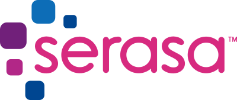

# SERASA Automation Tests

Run Automated Testes for UI and API

- `src` folder contains the Java code for the case study

**Requirements:**

- Java >= 1.8
- JDK >= 11.0.x
- Apache Maven >= 3.6.3

You can check out your version with the following command:

`java -version && mvn --version`

## Build
Run in the source of the application the command bellow to install dependencies:

`mvn clean test`